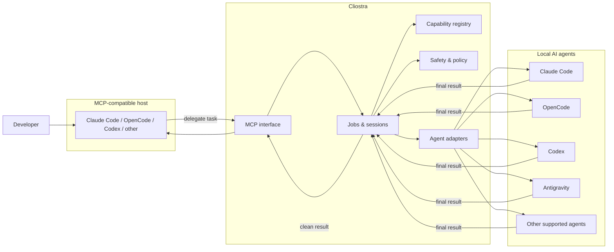

<div align="center">

# Cliostra

### Universal subagent orchestration for AI coding CLIs

**Turn the AI agents you already have installed and authenticated into interoperable subagents — through MCP, isolated sessions, and clean final-result handoffs.**

[](LICENSE)
[](#project-status)
[](https://modelcontextprotocol.io/)
[](https://go.dev/)

**AI agent orchestration · MCP · CLI agents · subagents · multi-provider · local-first · context-efficient**

</div>

---

## What is Cliostra?

Cliostra is an open-source project for **orchestrating AI agents that are already installed on your machine**.

The goal is to let any compatible AI coding agent act as a **host** and delegate work to other local AI agents as if they were native subagents. A host should be able to choose a target agent, select a model when supported, define a workspace, provide a focused prompt, start or resume an isolated session, let the delegated agent work, and receive only the final useful result.

Cliostra is designed around a simple idea:

> **Use the AI subscriptions and local agents you already have as specialized workers, without forcing the main agent to carry every exploration, tool call, log, and intermediate step in its own context.**

This is not intended to replace Claude Code, OpenCode, Codex, Antigravity, or other coding agents. Cliostra aims to make them **interoperable**.

## Why Cliostra?

Modern coding agents already know how to delegate work to internal subagents. The limitation is that those subagents usually live inside the same product or provider.

At the same time, many developers already pay for or use multiple AI coding tools. Each tool may have different models, quotas, strengths, reasoning modes, tools, skills, and context windows.

Cliostra aims to bridge those worlds:

- delegate research to one agent while the main agent keeps working;
- use a different subscription for a long-running analysis task;
- keep delegated exploration out of the main agent's context window;
- run each worker inside its own session and workspace;
- receive a clean final result instead of execution noise;
- choose which agents are hosts, workers, or both;
- expose the orchestration layer through MCP so it is not tied to one vendor.

The intended benefit is **better use of existing subscriptions and better context efficiency**, not quota bypassing or provider impersonation.

## Core concept

Cliostra treats AI agents as interchangeable roles rather than fixed products.

An agent may be:

- **Host** — consumes Cliostra through MCP and delegates work.
- **Worker** — receives a delegated task through an officially supported programmatic interface.
- **Both** — orchestrates in one workflow and can be orchestrated in another.

For example, Claude Code could delegate to Codex in one session, while OpenCode could delegate to Claude Code in another. Cliostra should not hard-code a permanent hierarchy between providers.

## How it should work



The intended execution model is:

1. A host asks Cliostra to delegate a task.
2. Cliostra validates which local agents are available and which capabilities are allowed.
3. The host chooses or requests a worker, model, effort level, workspace, session behavior, prompt, and optional capabilities when the target supports them.
4. Cliostra starts the worker through its supported local interface.
5. The worker runs in its own context and workspace scope.
6. Long-running work can continue independently instead of blocking the host unnecessarily.
7. The host receives the final result required to continue its own task.

The main agent should **not** receive the worker's full execution trace by default.

## Context-efficient delegation

Cliostra is intentionally designed around **context isolation**.

A delegated worker may inspect many files, invoke tools, perform searches, reason across a large context, or run for several minutes. The host usually does not need all of that information.

By default, the desired handoff is:

```text
Host -> focused task -> Cliostra -> external worker
Host <- final useful result <- Cliostra <- external worker
```

Not:

```text
Host <- every log, tool event, intermediate step and worker transcript
```

This does not eliminate the worker's own token or quota usage. The purpose is to **distribute work across available agents and reduce unnecessary context consumption in the host**.

## Long-running subagents

Some delegated tasks may take seconds; others may take many minutes.

Cliostra is intended to support a job/session model where the host can start a worker, continue doing other work, and later retrieve or receive the result. MCP includes task-oriented primitives for long-running operations, but Cliostra should remain usable even when a host does not yet implement every optional MCP capability.

The exact protocol contract is intentionally not frozen yet. The project is currently defining the cleanest compatibility model before implementation.

## Agent discovery

A major product goal is **near-zero configuration**.

Cliostra should be able to discover local AI tooling and distinguish between:

- installed;
- detected but not automatable;
- programmatic interface available;
- capabilities known;
- policy validated;
- enabled as a worker;
- enabled as an MCP host.

Detection may use PATH lookup, known installation locations, configuration directories, desktop application metadata, or capability probes depending on the product and platform.

Detecting an application does **not** automatically mean Cliostra is allowed or technically able to orchestrate it.

## TUI configuration experience

Cliostra is planned to include an interactive terminal UI so setup feels closer to:

```text
install -> detect -> select -> connect -> use
```

The TUI is expected to help users:

- discover installed AI agents;
- see which ones are actually orchestrable;
- choose which agents can act as hosts;
- choose which agents can act as workers;
- inspect capabilities supported by each integration;
- configure MCP connections without manually editing multiple files;
- validate connectivity;
- inspect available skills and optional agent capabilities.

The TUI is a control plane for configuration. It should not be required for normal runtime operation.

## Skills and specialized workers

Cliostra is also exploring **skill-aware delegation**.

The idea is to detect skills already installed for compatible agents and allow users to associate selected skills with selected workers or task profiles. When a delegated task starts, Cliostra could activate only the relevant capability if the target agent supports doing so safely and efficiently.

This is still under evaluation. Automatically injecting complete skill content into every task may increase context usage and work against the project's primary goal. Cliostra will prefer native provider mechanisms when available and should load only what is necessary.

## Cross-platform goal

Cliostra is intended to support:

- Linux
- macOS
- Windows

The core is planned in **Go** because the project benefits from a lightweight native binary, process supervision, concurrency primitives, and straightforward cross-platform distribution.

The TUI framework is not locked yet. Bubble Tea is being evaluated because it is a mature Go TUI ecosystem and fits the single-binary direction.

## MCP-first, vendor-agnostic

Cliostra uses MCP as the interoperability layer for hosts because the project should not depend on one specific coding agent.

Any host that can consume the required MCP tools should be able to use Cliostra. Worker integrations are separate adapters because each AI agent exposes different capabilities, session semantics, model selection, permission systems, and automation surfaces.

Cliostra therefore separates:

- **host interoperability** through MCP;
- **worker compatibility** through provider-specific adapters;
- **capability discovery** so unsupported features are not assumed;
- **policy validation** so a technically possible integration is not automatically considered acceptable.

## Security and provider policies

Cliostra is built around official local interfaces, not credential extraction.

The project will not intentionally:

- copy or export provider access tokens;
- scrape authenticated web applications;
- impersonate provider APIs;
- bypass quotas, rate limits, approvals, or safety controls;
- rotate accounts to evade limits;
- expose a personal subscription as a shared public service;
- silently grant workers unrestricted shell, network, or filesystem access.

Each provider integration must be reviewed independently because technical automation support and account terms are not always equivalent.

See [`docs/SECURITY_AND_POLICY.md`](docs/SECURITY_AND_POLICY.md) for the project's security and provider-policy posture.

## Planned integrations

The following agents are part of the research and design scope. This table does **not** mean they are implemented or approved for stable use yet.

| Agent | Host role | Worker role | Current project status |
| --- | --- | --- | --- |
| Claude Code | MCP-capable | Programmatic surfaces exist | Research / adapter design |
| OpenCode | MCP-capable | Local/open-source integration candidate | Research / adapter design |
| OpenAI Codex | MCP-capable depending on setup | Programmatic CLI/SDK surfaces exist | Research / policy validation |
| Google Antigravity | Under evaluation | Headless automation exists | Policy validation required |
| Other MCP hosts | Candidate | Depends on adapter | Extensible by design |

Provider support will only be marked stable after technical, security, and policy validation.

## Project status

Cliostra is currently in **design / pre-alpha**.

The repository intentionally starts documentation-first. The architecture, trust boundaries, provider policies, long-running job behavior, and user experience are being defined before implementation so the first code does not lock the project into an unsafe or provider-specific design.

There is no stable release or installation command yet.

## Design principles

Cliostra follows a small set of project-level principles:

- **Local-first** — orchestration happens on the user's machine.
- **Provider-agnostic** — no provider is permanently the orchestrator or worker.
- **MCP-first for hosts** — interoperability should be standard, not bespoke.
- **Capability-driven** — adapters advertise what they actually support.
- **Context-efficient** — return the useful result, not execution noise.
- **Subscription-aware, not quota-evading** — use legitimate access without bypassing provider controls.
- **Least privilege** — workers receive only the permissions required for the task.
- **Clean setup** — configuration should be discoverable and interactive rather than manual and fragile.
- **Cross-platform** — Linux, macOS, and Windows are first-class targets.
- **Open-source extensibility** — adding a new agent should be an adapter problem, not a core rewrite.

## Documentation

- [`docs/PROJECT_VISION.md`](docs/PROJECT_VISION.md) — product vision, orchestration model, TUI goals, discovery, jobs, sessions, and skills.
- [`docs/SECURITY_AND_POLICY.md`](docs/SECURITY_AND_POLICY.md) — account safety, provider terms, permissions, credentials, prompt injection, and integration criteria.
- [`CONTRIBUTING.md`](CONTRIBUTING.md) — how to contribute.
- [`SECURITY.md`](SECURITY.md) — how to report security issues.

## Contributing

Cliostra is intended to grow as a community project. Useful contributions include provider research, adapter design, MCP interoperability, Windows/macOS/Linux discovery logic, TUI UX, security review, tests, documentation, and policy verification.

Please read [`CONTRIBUTING.md`](CONTRIBUTING.md) before opening implementation work. Since the project is pre-alpha, major architectural changes should begin as a discussion or issue before large code contributions.

## License

Cliostra is licensed under the [Apache License 2.0](LICENSE).

## Disclaimer

Cliostra is an independent open-source project and is not affiliated with, endorsed by, or sponsored by Anthropic, OpenAI, Google, OpenCode, or other AI-agent providers mentioned in this repository. Product names and trademarks belong to their respective owners.

Users remain responsible for complying with the terms, quotas, data policies, and acceptable-use rules of every provider they connect.

---

<div align="center">

**Cliostra** — make your AI agents work together without making one agent carry everything.

</div>
