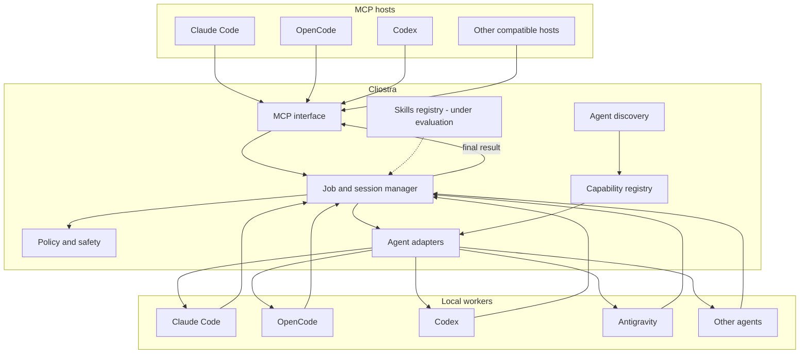

# Project Vision

## Purpose

Cliostra is a local orchestration layer for AI coding agents.

Its purpose is to let one AI agent delegate work to another installed agent as if the second agent were a native subagent, while keeping the delegated work in an isolated session and returning only the useful final result to the host.

The project is motivated by a practical reality: developers increasingly use several AI coding products at the same time. Those products may be authenticated through different subscriptions and may have different models, quotas, strengths, tools, skills, reasoning controls, and context windows.

Cliostra aims to make those local agents interoperable without turning personal subscriptions into unofficial APIs and without forcing the main agent to carry all delegated work inside its own context.

## Product model

Cliostra does not define permanent orchestrators and permanent workers.

An integrated agent can potentially act as:

- a **host**, when it can consume Cliostra through MCP;
- a **worker**, when it exposes an officially supported local/programmatic interface that Cliostra can invoke;
- **both**, when both capabilities exist.

This means the same agent may delegate in one workflow and be delegated to in another.

The architecture must therefore be provider-agnostic. Adding a new agent should primarily require a new adapter and capability description, not changes to the orchestration model itself.

## Desired delegation experience

From the host's point of view, an external worker should feel similar to a native subagent.

A delegation should be able to express, when supported by the target agent:

- which worker to use;
- which model to use;
- reasoning or effort level;
- workspace or working directory;
- task prompt and worker-specific instructions;
- session creation or session continuation;
- allowed tools or permissions;
- optional skills or specialized capabilities;
- whether the execution is short-lived or long-running.

The worker performs the task in its own context and returns a final result to Cliostra. Cliostra then returns the useful result to the host without injecting the entire worker transcript into the host context.

The exact MCP tool names, schemas, persistence format, and session contract are intentionally not fixed at this stage.

## Why context isolation matters

Delegated work can be expensive in context even when the final answer is small.

A worker may:

- inspect dozens of files;
- search documentation;
- invoke tools repeatedly;
- perform code analysis;
- test hypotheses;
- build a large private working context.

The host often needs only a conclusion, patch summary, decision, or structured result.

Cliostra therefore treats context isolation as a product goal rather than an implementation detail.

The project is not claiming to eliminate token usage. The worker still consumes its own provider quota. The goal is to reduce unnecessary token/context pressure on the host and make better use of multiple legitimate subscriptions already available to the user.

## Long-running work

Cliostra should support delegated work that lasts longer than a normal synchronous tool call.

The desired behavior is:

1. a host starts a delegated job;
2. Cliostra supervises the worker execution;
3. the host can continue other work;
4. Cliostra tracks job/session state;
5. the result can be retrieved or delivered when the job completes;
6. cancellation is possible when the underlying worker supports it;
7. operational logs remain separate from the final result.

MCP includes mechanisms for task-oriented long-running operations, but the project should not assume that every host implements every optional MCP feature. Compatibility behavior must be designed so basic MCP hosts can still use Cliostra cleanly.

## Agent discovery

Cliostra should minimize manual setup by discovering AI tooling already present on the system.

Discovery may examine:

- executables available in `PATH`;
- known installation locations;
- application metadata;
- configuration directories;
- version/help output;
- local capability probes;
- desktop application presence when relevant.

Discovery must distinguish between several states. An agent can be installed but not safely automatable. It can expose a programmatic interface but still require provider-policy validation before Cliostra enables it.

The internal capability model should be able to describe features such as:

- MCP-host capability;
- programmatic worker capability;
- model selection;
- effort/reasoning selection;
- session resume;
- structured output;
- sandboxing;
- filesystem permissions;
- network permissions;
- tools;
- skills;
- cancellation;
- long-running execution.

Cliostra must not pretend that all agents support the same features.

## TUI experience

The intended setup experience is:

```text
install -> detect -> select -> connect -> use
```

Cliostra should provide a TUI that acts as a control plane over the same core runtime.

The TUI should eventually help users:

- discover local agents;
- see installation and compatibility status;
- select which agents can be hosts;
- select which agents can be workers;
- inspect capabilities;
- configure required MCP connections;
- validate that an integration works;
- manage project/global configuration;
- inspect skills and optional capabilities;
- diagnose unavailable or policy-disabled integrations.

The TUI should not be required during normal orchestration. Once configured, hosts should call Cliostra directly through MCP.

## Skills

Skill-aware delegation is part of the project direction but remains under evaluation.

Cliostra may detect skills or reusable agent instructions available locally and allow users to associate them with selected workers or task profiles.

The design must avoid blindly copying every skill into every delegated prompt. That would increase context and undermine the project's context-efficiency goal.

Preferred behavior is to use a worker's native skill mechanism when one exists. If a worker has no native mechanism, any injection strategy must be explicit, minimal, and measurable.

## Cross-platform direction

Cliostra is intended to support Linux, macOS, and Windows.

The core is planned in Go because the project benefits from:

- native binaries;
- straightforward cross-compilation;
- strong process supervision primitives;
- concurrency without requiring a separate runtime;
- low deployment friction;
- good fit for a terminal-oriented local tool.

This does not lock every project component to a particular library. Framework choices should be made after the interfaces and behavior are validated.

## Conceptual architecture



This diagram describes responsibilities, not implementation packages or final API names.

## Non-goals

Cliostra is not intended to:

- become another foundation model;
- replace the AI coding agents it integrates;
- provide a shared account service;
- extract provider credentials;
- emulate private provider APIs;
- automate web UIs as a substitute for supported programmatic access;
- bypass rate limits, quotas, approvals, safety controls, or provider restrictions;
- guarantee that every installed application can be orchestrated;
- force every provider into one lowest-common-denominator feature set.

## Success criteria

Cliostra will be successful when a developer can install it, let it discover compatible local agents, select allowed hosts/workers, connect a host through MCP, delegate a focused task to a worker, continue other work when appropriate, and receive a clean final result — without manually wiring every provider or moving full worker transcripts into the host context.

The project should make that workflow feel native, predictable, secure, and easy to extend.
